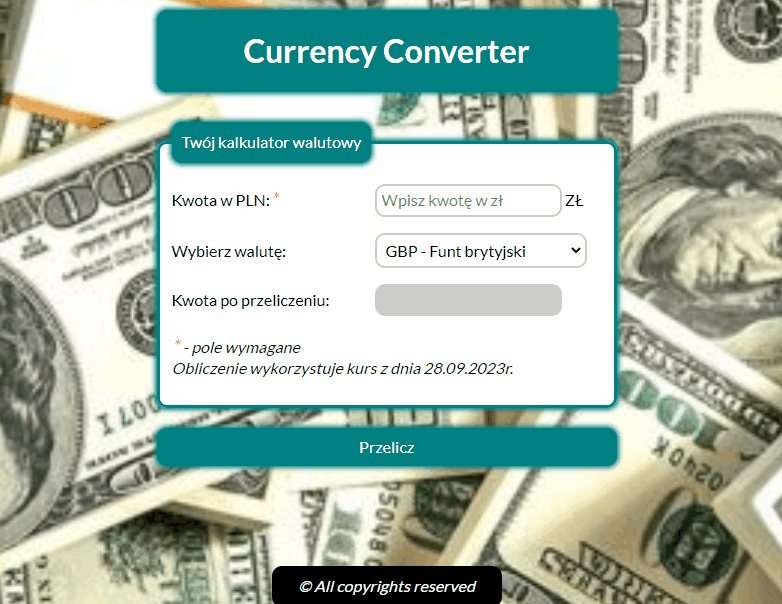

# Dominik Krzyżanowski

## 💰 Currency-Calculator
Do not forget to visit my website 👉 [*Currency-Calculator*](https://dominik-krzyzanowski.github.io/Currency-Calculator/) 👈

## 📖 Description
It is vert simple currency calculator.
1. Put the value of the money you want to exchange.
2. Select the currency into which you want to exchange money. 
3. Press the button "Przelicz".
   
  

## 🛠 Technologies
- HTML, CSS, BEM
- Java Script, ES 6+ features
